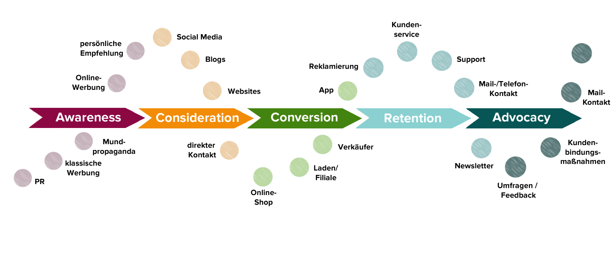
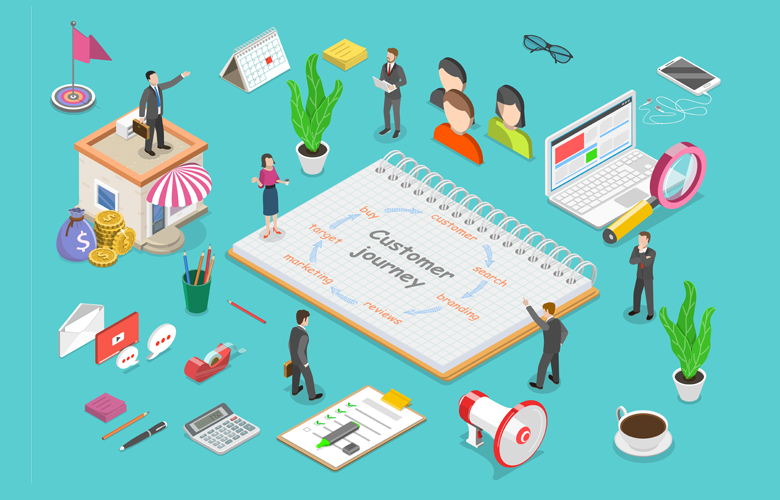

+++
title = "Präsentation & Customer Journey"
date = "2022-12-06"
draft = false
pinned = false
tags = ["CustomerJourney", "IKEA"]
image = "customer-journey-mapping.webp"
description = "Anfang hatte ich mit Berdan (Gruppenmitglied) unsere Präsentation. Danach hat Herr Herr Baumberger, mit uns den \"Customer Journey\" angeschaut und analysiert. Anschliessend haben wir einen Auftrag bekommen, indem wir unseren eigenen Customer Journey skizzieren durften."
footnotes = "Erstellt von Mohamad Saleh,  06.12.2022\n\nhttps://www.google.com/url?sa=i&url=https%3A%2F%2Fwww.advidera.com%2Fglossar%2Fcustomer-journey%2F&psig=AOvVaw3Bv-aq6OE2VZ1tFZ2ru9rL&ust=1671031598448000&source=images&cd=vfe&ved=0CBAQjRxqFwoTCJioz_jz9vsCFQAAAAAdAAAAABAE\n\nhttps://www.bankingclub.de/wp-content/uploads/2018/11/Bankingnews_Customer-Journey_Webinar.png\n\nhttps://images.hiverhq.com/blog/wp-content/uploads/2021/02/tr:pr-true/Customer-Journey-Mapping.png"
+++
Am heutigen Tag hatte ich zuerst mit meinem Gruppenpartner eine Präsentation vor der Klasse, indem wir 10-15min unsere Geschäftsidee präsentiert haben. Nach unserer Präsentation wurden wir mit verschiedenen Fragen konfrontiert, was uns für die Weiterentwicklung unserer Idee weitergeholfen hat.

Unsere Lehrperson (Herr Baumberger), hat uns den Customer Journey vorgestellt**. *Ein Customer Journey ist ein Begriff aus dem Marketing und bezeichnet die einzelnen Zyklen, die ein potenzieller Kunde durchläuft, bevor er sich für den Kauf eines Produktes entscheidet***. Zuerst war es etwas schwierig die Idee dieser Konstruktion zu verstehen, da man anfangs nicht richtig das Verhalten der Kunden einschätzen konnte, jedoch habe ich schnell gemerkt, dass diese Abbildung sehr hilfreich sein kann. Da man sich die Zeit nimmt, die Gefühle und das Verhalten der Kunden noch besser nachzuvollziehen. Danach haben wir ein Blatt bekommen, indem wir unseren eigenen Customer Journey skizziert haben, anhand unseres Geschäftsidee. Das Customer Journey enthaltet Aspekte wie (**Doing, Thinking**, **Touchpoints**, **Weaknesses**, **Opportunities**), welches (Aufmerksamkeit, Suche, Auswahl, Lieferung und After-Sales) übergeordnet ist. Anhand von dem, was man notiert, kann man die Übergänge der Emotionen der Kunden von Positiv und Negativ betrachten.

Die Abbildung ist sehr hilfreich, denn man sieht das Verhalten des Kunden während dieses Prozesses plötzlich von einer anderen Sichtweise. Das nächste Mal schaue ich mir vielleicht noch ein paar andere Customer Journey Beispiele von anderen Firmen an, um die Gefühle und das Verhalten der Kunden noch besser einschätzen zu können.

