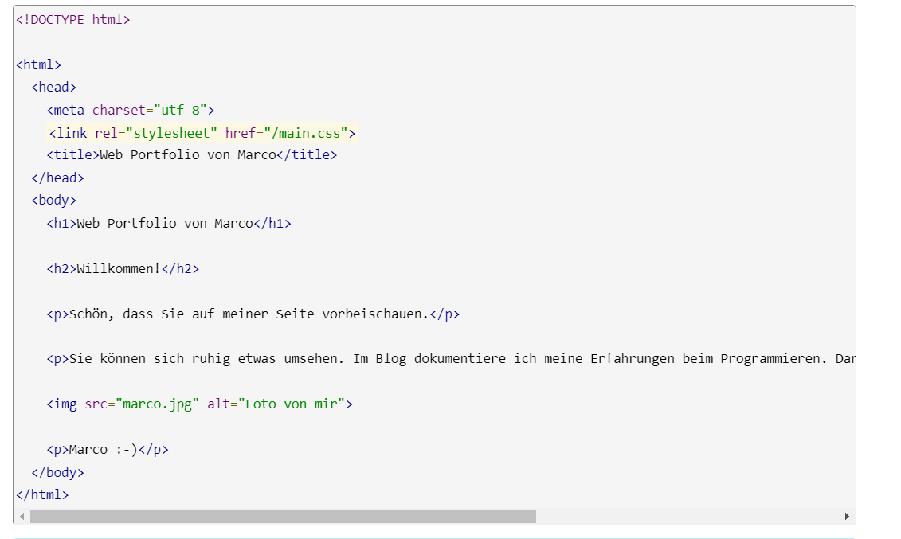

+++
title = "Webseite programmieren (HTML & CSS)"
date = "2022-11-01"
draft = false
pinned = false
tags = ["html", "css", "webseite", "twitch", "codes"]
image = "visual-studio.png"
description = "Heute hat uns unsere WEB Lehrperson gezeigt, wie man Farben auf seiner Webseite einfügt mit main.css. Danach haben wir genug Zeit bekommen selber weiterzuarbeiten an unserer Webseite, indem wir anhand der Webseite \"code.makery.ch\", mit der Anleitung weitergefahren haben."
footnotes = "Erstellt von Mohamad Saleh, Zuletzt bearbeitet am 13.12.2022\n\n[Teil 1: Unsere erste Webseite | HTML & CSS Tutorial (Deutsch) | code.makery.ch](https://code.makery.ch/de/library/html-css/part1/)\n\n[Visual Studio Code - Code Editing. Redefined](https://code.visualstudio.com/)"
+++
Am "01.11.2022" haben wir weiter gearbeitet an unserer Webseite mit HTML (Hypertext Markup Language), und CSS (Cascading Style Sheets), indem wir anhand der Webseite «code.makery.ch», die einzelnen Schritte selbst auf unsere Webseite umgesetzt haben. Auf dieser Webseite ist alles klar und deutlich beschrieben, wie man seine ersten Erfolge beim Programmieren schafft. Die Vorgaben, haben wir auf das Programm «Visual Studio Code» umgesetzt. «Visual Studio Code» ist ein Programm, auf den man programmieren kann und verschiedene Codes und Befehle eingeben kann, welches sich aufeinander bauen.

Ich bin dran eine Webseite für einen «Twitch Kanal» zu erstellen. Auf dieser Webseite sollte man am Schluss alle Informationen über den Kanal finden, sowie die Stream Termine und weitere Informationen über den Stream und den Streamer. Um dies auf die Reihe zu kriegen, benötigt man jedoch verschiedene Codes sowie Zeit und Geduld.

Die ersten Codes die man am Anfang lernt, sind zum Beispiel:

\-<html>   (öffnenden Tag)  </html>    (schliessendes Tag)

\-<body>  (Informationen werden nicht im Hauptbereich des Browsers gezeigt)

\-<head>  (zusätzliche Informationen über die Webseite)

\-   (Bild einfügen)

\-<title>   (Titel einfügen)

\-<h2> - <h6>  (für Überschriften)

Jedoch benötigt man viel mehr als diese Codes, denn zunächst muss man diese richtig zusammensetzen und dabei keine Fehler machen, ansonsten besteht das Gefahr, das der ganze Code nicht funktioniert. Das war eines der Umfangreichsten Themen, die wir im Fach Web angeschaut haben, denn es war ein neues Gebiet für mich. Das nächste Mal werde ich aber viel mehr am Programm ausprobieren und auch Gewagtes versuchen, auch wenn das Gefahr besteht, das der Code falsch ist.

