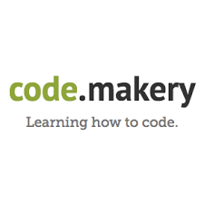

+++
title = "Webseite programmieren (Visual Studio Code)"
date = "2022-11-01"
draft = false
pinned = false
tags = ["html", "webseite", "twitch"]
image = "visual-studio.png"
description = "Heute haben wir weiter gemacht mit unserer Webseite zu programmieren. Wir haben noch mit \"main.css\" gearbeitet indem wir Farben für unserer Webseite programmiert haben."
footnotes = "Erstellt von Mohamad Saleh"
+++
Heute "01.11.2022" haben wir weiter gearbeitet an unserer Webseite, indem uns Herr Baumberger den "main.css" gezeigt hat wie man Farben rein programmiert in unsere Webseite.

Dafür haben wir anhand der Webseite "https://code.makery.ch" die Einleitung gehabt, indem wir von dort anschauen konnten ob wir es auch richtig gemacht haben. Wir programmieren unsere Sachen auf der App "Visual Studio Code)

Für das nächste Mal will noch mehr darüber lernen und meine Seite noch professioneller gestalten.

